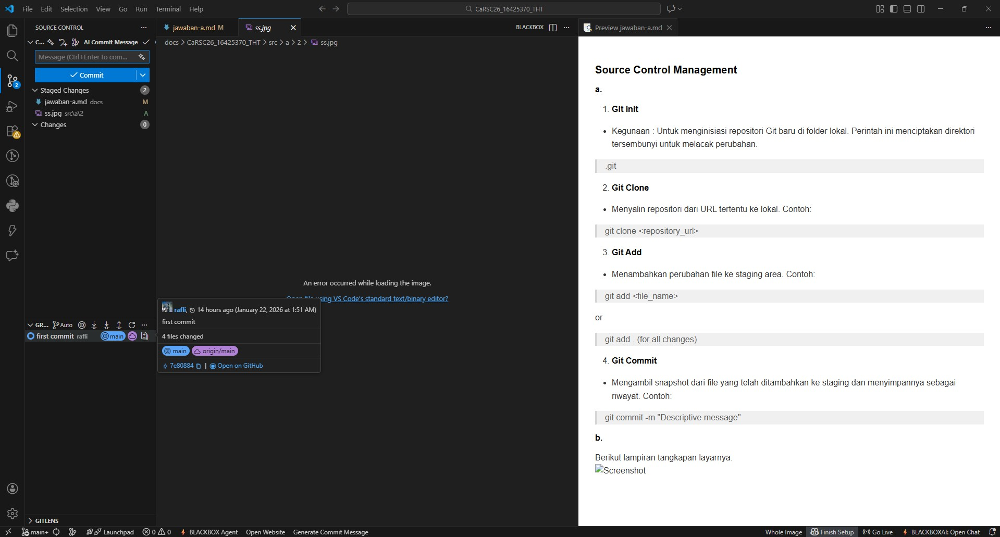
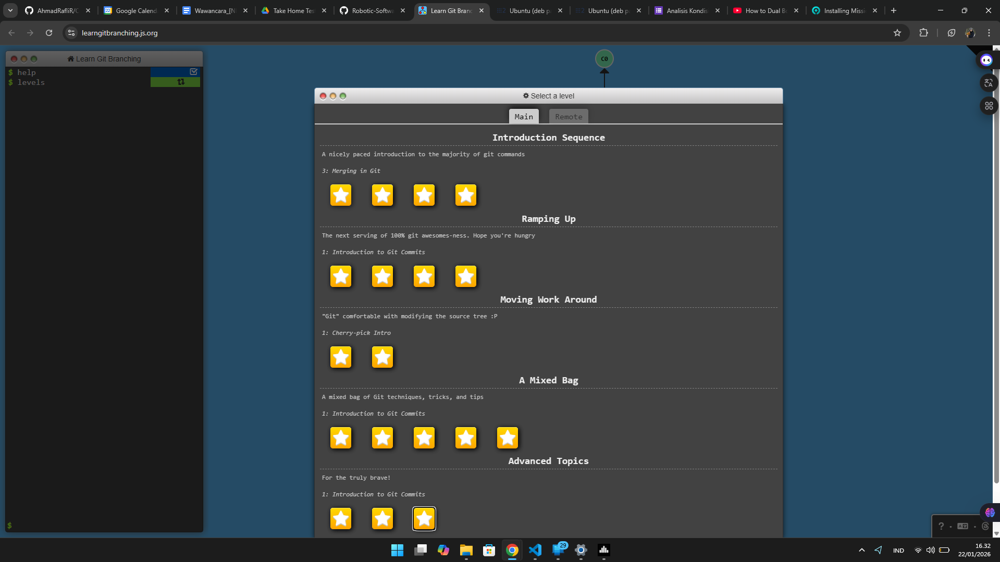
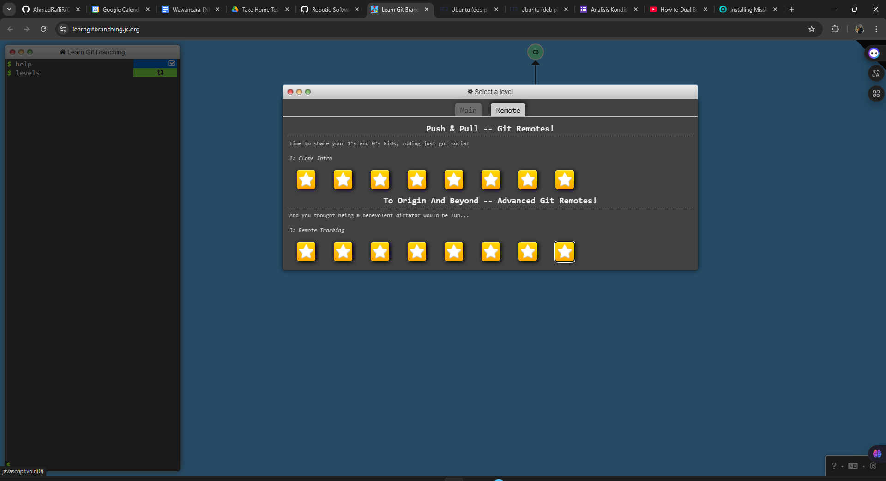
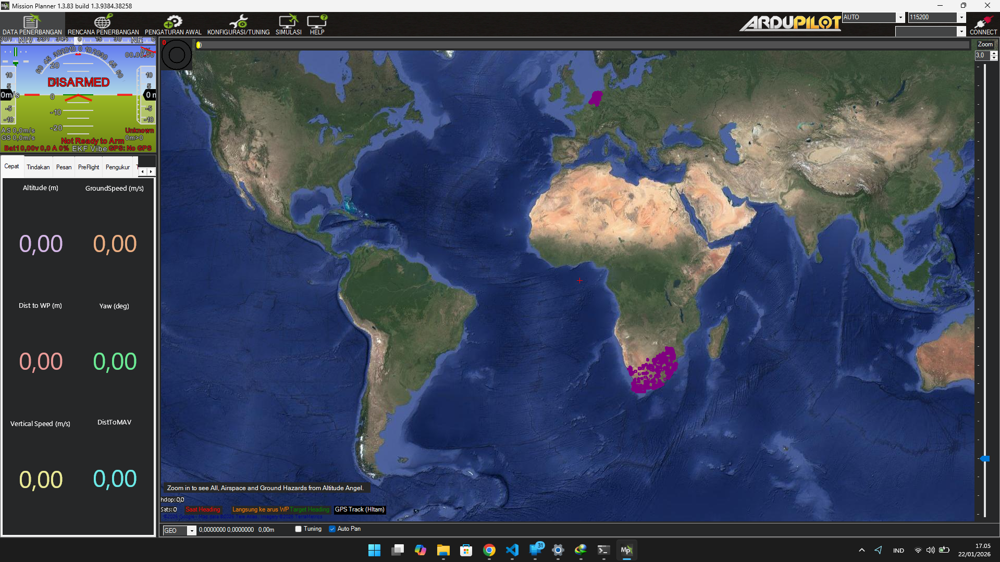
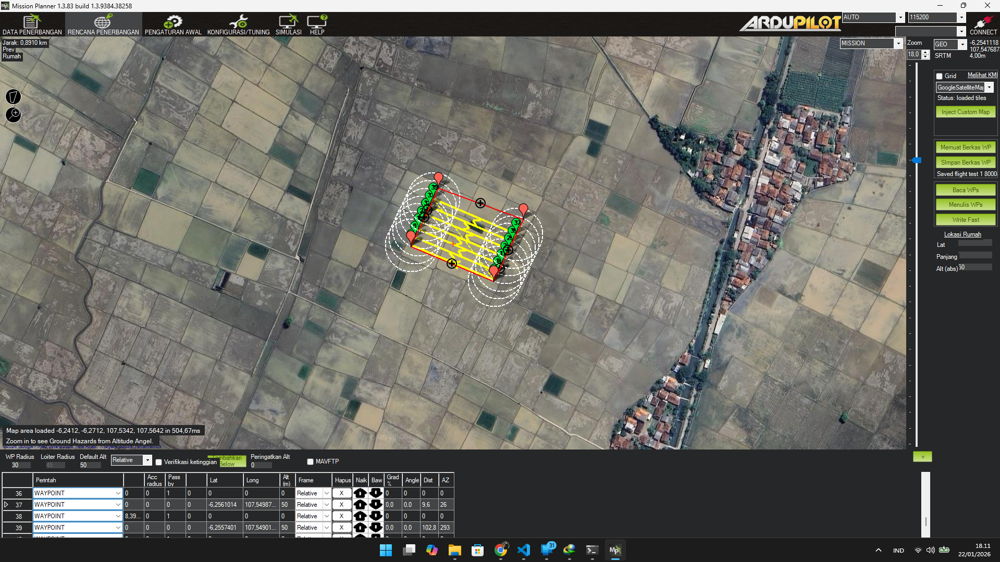
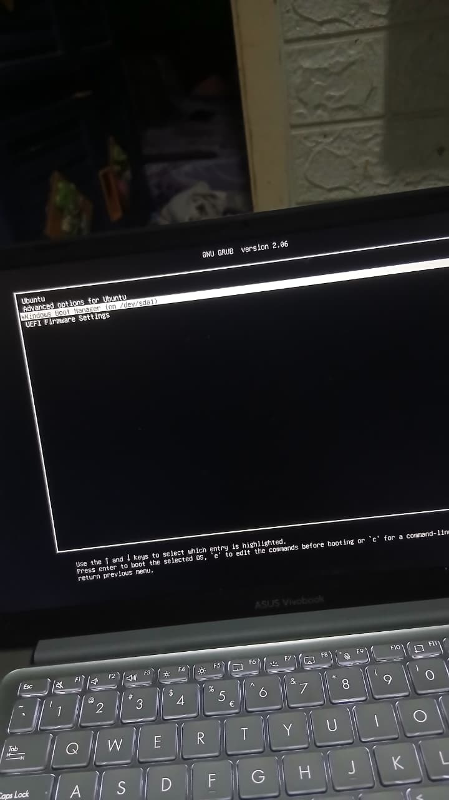
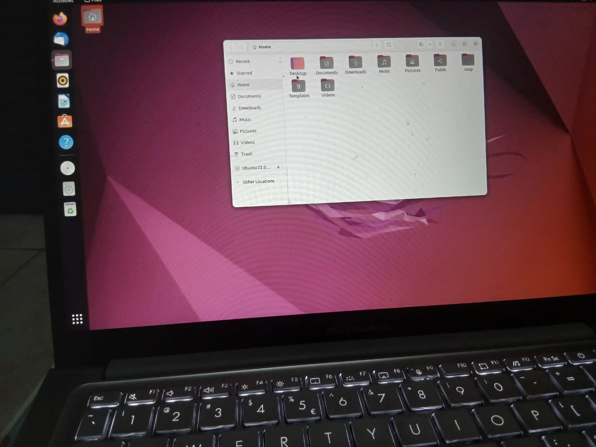

#### 1. Analkon
Sudah saya isi.
#### 2. Source Control Management
##### a. 4 Commands dalam Git
1. **Git init**
 * Kegunaan : Untuk menginisiasi repositori Git baru di folder lokal. Perintah ini menciptakan direktori tersembunyi untuk melacak perubahan.
 > .git

2. **Git Clone**
 * Menyalin repositori dari URL tertentu ke lokal. Contoh:
> git clone <repository_url>
3. **Git Add**
 * Menambahkan perubahan file ke staging area. Contoh:
 > git add <file_name> 

or 
 > git add . (for all changes)
4. **Git Commit** 
 * Mengambil snapshot dari file yang telah ditambahkan ke staging dan menyimpannya sebagai riwayat. Contoh: 
 > git commit -m "Descriptive message"

##### b. Setup Git dan VSCode

Berikut lampiran tangkapan layarnya.

 ##### c. learn git branching

Telah menyelesaikan Main Topic.

Telah menyelesaikan Remote Topic.

 ##### d. Git SSH Security

Telah menyelesaikan Git SSH (Secure Shell) Security dari [_W3School_](https://www.w3schools.com/git/exercise.asp?x=xrcise_security_ssh1).

#### 3. Pengenalan Ground Control Station

##### a. Instalasi Mission Planner

Saya menginstall Mission Planner (Windows ver.)

Berikut tangkapan layar utamanya :

##### b. 4 Fitur utama Mission Planner

**1. Flight Planning**

* **Kegunaan :** kita bisa membuat rute terbang UAV. titik ke titik, waypoint, ketinggian, estimasi kecepatan. Kita juga bisa membuat UAV terbang sesuai jalurnya, misalnya untuk pemetaan atau patroli.

**2. Live Telemetry & Monitoring**
* **Kegunaan :** Mission Planner menampilkan data UAV secara real time. posisi, ketinggian, kecepatan, baterai, arah terbang. Jadi operator bisa “merasakan” kondisi UAV walau di darat. dalam kasus kritis, misalnya baterai drop, bisa langsung _make decision_.

**3. Configuration & Calibration**
* **Kegunaan :** fitur ini dipakai untuk setting awal UAV. kalibrasi sensor seperti accelerometer, compass, radio, ESC. Singkatnya agar UAV tidak error dan tetap terkendali. Dalam kasus ketika kalibrasi tidak benar maka terbangnya bisa miring, atau nggak stabil, bahkan crash.

**4. Flight Data Log & Analysis**
* **Kegunaan :** Mission Planner bisa nmenyimpan data penerbangan setelah misi selesai, data ini bisa dibuka lagi. dipakai buat evaluasi, kenapa UAV kurang stabil, kenapa belok telat, atau kenapa baterai cepat habis. ini penting buat ningkatin performa misi berikutnya.

##### c. Misi pemetaan

Misi pemetaan sederhana untuk area persegi panjang 100 meter dan lebar 80 meter.

Screenshots Flight Route Mission dari Mission Planner dengan luas 100m x 80m :

Karena saya menggunakan **focal length** kamera yang cukup sempit maka rutenya akan lebih panjang untuk merekam seluruh area.

[File Waypoints (flight test 1 8000m²)](<../src/3/flight test 1 8000m^2.waypoints>)

#### 4. Development Environment
Saya menginstall **dual boot** Ubuntu (22.04.5 LTS Jammy Jellyfish ver.) ›dalam Partisi yang berbeda, dengan root bootloader system tetap berada di EFI Windows Boot Manager.

Berikut lampiran proses dan UI awalnya :

##### a. Instalasi
 > python3, python3-pip, python3-venv, uvicorn, dan build-essential

lewat terminal menggunakan perintah
 > sudo apt install

##### b. instalasi
 > ROS2 Humble

sekaligus menjalankan _sistem talker-listener sederhana_

berikut tangkapan layarnya :

#### 5. Dasar-Dasar UAV

##### a. Berikut perbedaan dari VTOL, HTOL, dan Hybird :

**VTOL (Vertical Take Off and Landing)** 
salah satu mekanisme yang serupa dengan cara helikopter, yaitu naik turun vertikal tanpa runway. _Propellernya_ kerja untuk mengangkat dan tidak memerlukan lahan panjang untuk start. ini sering dipake ketika area sempit atau misi inspeksi yang butuh _hover._

**HTOL (Horizontal Take Off and Landing)/Fixed-wing**
Mekanisme pesawat pada umumnya, dia butuh jalur buat take off dan landing, sebab sayapa mengangkat lewat aerodinamis kecepatan maju. ini bagus buat terbang jauh dan hemat energi, tapi kurang fleksibel untuk _hover._

**Hybrid** 
Merupakan mekanisme gabungan dari 'VTOL' dan 'HTOL', bisa takeoff vertikal sekaligus memiliki kemampuan terbang fixed-wing. sistem ini lunayan fleksibel di tempat sempit tapi juga bisa jelajah jauh dengan efisien. contohnya UAV yang _Propeller_ berdiri dulu lalu berubah buat terbang cepat.

##### b. Roll, Yaw, dan Pitch; air speed vs ground speed + HDOP dan RSSI

roll, yaw, pitch itu merupakan “cara gerak tubuh pesawat”:

1. **Roll** itu ketika UAV miring kiri kanan terhadap sumbu depan-belakang.[^1]

[^1]: [TechnoGIS - Kelebihan UAV VTOL](https://www.technogis.co.id/kelebihan-pesawat-uav-vtol/)

2. **Pitch** adalah ketika pesawat (hidung naik atau turun) terhadap sumbu samping.[^2]

[^2]: [Pitch UAV](https://link.springer.com/article/10.1007/s42452-025-07357-8?utm_source=chatgpt.com)

3. **Yaw** itu kondisi ketika badan UAV ke kiri atau kanan terhadap sumbu vertikal.[^3}]

[^3}]: [Yaw UAV](https://ejournal.istn.ac.id/index.php/sinusoida/article/download/1669/1091?utm_source=chatgpt.com)

1. **Air speed** merupakan kecepatan udara yang “dirasakan pesawat terhadap udara di sekitarnya”.

2. **Ground speed** itu kecepatan UAV relatif ke tanah di bawahnya. kalau angin kenceng kadang air speed bisa beda jauh dari ground speed.

1. **HDOP (Horizontal Dilution of Precision)** merupakan ukuran “seberapa bagus posisi GPS horizontalnya”. ketika angkanya kecil maka lebih akurat, angka besar itu kurang akurat, karena tergantung posisi satelit yang diliat GPS. itu menentukan seberapa valid lokasi UAV.[^4]

[^4]: [Memahami HDOP dalam UAV](https://www.youtube.com/watch?v=54O8JCpG9pc&utm_source=chatgpt.com)

2. **RSSI (Received Signal Strength Indicator)** ini semacam indikator “kuat lemahnya sinyal radio” yang didapat UAV atau ground station. nilai tinggi berarti sinyalnya kuat, rendah berarti sinyal lemah. ini penting supaya komunikasi UAV-ground station tetap lancar.

##### c. Komponen UAV dan DIagram bloknya untuk pemetaan

Berikut Komponenya :

* Frame/badan UAV
struktur tempat semua part nempel.
* Motor & propeller
yang membuat UAV bisa angkat dan terbang.
* ESC (Electronic Speed Controller)
Mengatur motor agar spin sesuai perintah.[^5]
[^5]:[Anatomy UAV](https://beyondsky.xyz/blog/hardware/anatomy-of-a-drone-understanding-key-hardware-components?utm_source=chatgpt.com)
* Flight controller
Otaknya UAV yang baca sensor dan mengatur motor.
* GPS/IMU sensors
Memberi info posisi dan orientasi UAV.
* Battery
sumber tenaga.
* Payload (kamera pemetaan / sensor)
di UAV pemetaan ini biasanya ada kamera foto resolusi tinggi.
* Telemetry radio/receiver-transmitter
untuk komunikasi data ke ground station.

**Berikut diagram bloknya :**

battery → power distro → flight controller ← sensors (IMU, GPS)
                                ↓
                       ESCs → motors/propellers
                                ↓
                           payload/camera
                                ↓
                        telemetry radio ↔ ground station

##### d. Publikasi Ilmiah

Saya menemukan satu jurnal yang menarik tentang UAV untuk pemetaan skala besar dengan judul _"Perbandingan Akurasi UAV Multirotor dan Fixed Wing Berbasis Post Processing Kinematic (PPK) untuk Pemetaan Skala Besar."_[^6]

[^6]:[Jurnal:Perbandingan Akurasi UAV Multirotor dan Fixed Wing Berbasis Post Processing Kinematic (PPK) untuk Pemetaan Skala Besar](https://jurnal.upnyk.ac.id/index.php/imagi/article/view/15792?utm_source=chatgpt.com)

Dalam jurnal tersebut, dilakukan perbandingan dua tipe UAV untuk pemetaan: 
* multirotor (kayak quadcopter)
* fixed-wing/VTOL

Metode PPK digunakan untuk membuat data GPS lebih akurat. itu penting di pemetaan karena kita ingin titik di foto itu presisi pas dijadiin peta.

Hasilnya, UAV multirotor dengan beberapa Ground Control Points (GCP) punya akurasi horizontal yang sangat baik, sementara fixed-wing terkadang bisa unggul di vertikal tergantung pakai GCP atau nggak. bedanya tekstur foto juga keliatan karena tinggi terbang dan kamera tiap UAV beda.

#### 6. Algoritma

##### a. A* (A-star) dan D* (D-star)

**A*** merupakan algoritma pencari jalur. idenya sederhana, tapi cerdas.
algoritma ini mencari jalur dari titik awal ke tujuan dengan _guessing_ jalur mana yang paling masuk akal buat dicoba dulu.[^7]
[^7]:[Stanford:A* Comparison](https://theory.stanford.edu/~amitp/GameProgramming/AStarComparison.html)

Parameter perhitungan A*:

1. Jarak yang udh ditempuh dari awal

2. Perkiraan jarak ke tujuan (heuristic)

jadi, tiap node itu dinilai, mana yang total biayanya paling kecil, itu yang dipilih dulu. Oleh karena itu A* cepat dan cukup efisien, selama petanya udh jelas dari awal.[^8]

[^8]:[Youtube "Sebastian Lague;A* Pathfinding](https://www.youtube.com/watch?v=-L-WgKMFuhE&pp=ygUuQSBQYXRoZmluZGluZyBFeHBsYWluZWTigJ0g4oCTIFNlYmFzdGlhbiBMYWd1ZQ%3D%3D0)

_dipakai kapan dan di mana?_

1. game (AI karakter jalan)

2. robot dan UAV buat path planning offline

3. sistem navigasi kalau lingkungannya statis

**D*** mirip A*, tapi lebih _aware_.
jika A* cocok untuk peta yang sudah fix, maka D* cocok _case_ nyata yang dinamis. misalnya UAV nemu rintangan baru, atau peta sebelumnya salah. D* bisa update jalur tanpa hitung ulang semuanya dari nol.

_dipakai kapan dan di mana?_

1. Robot eksplorasi

2. UAV di lingkungan dinamis

3. Kendaraan otonom

##### b. PID (Proportional – Integral – Derivative)

**PID** itu algoritma kontrol paling klasik, namun masih digunakan sampai sekarang.
fungsinya untuk membuat sistem _obey_ ke target.[^9]

[^9]:[Youtube "Brian Douglas" - Kontrol PID](https://www.youtube.com/watch?v=UR0hOmjaHp0&pp=ygUtUElEIENvbnRyb2xsZXIgRXhwbGFpbmVk4oCdIOKAkyBCcmlhbiBEb3VnbGFz)

* Cara kerjanya seperti ini:

  * **P:** makin besar error, makin besar respon

  * **I:** ngumpulin error lama, biar error kecil bener-bener hilang

  * **D:** ngeliat kecepatan perubahan error, biar nggak kebablasan

Dalam dunia UAV, PID dipake untuk:

1. Menjaga roll, pitch, yaw

2. Menjaga altitude

3. Kontrol kecepatan motor

_dipakai di mana lagi?_ 
industri, robot, motor listrik, bahkan sistem suhu.

##### c. Kalman FIlter dan Extended Kalman Filter (EKF)

Sensor tidak pernah akurat 100%. Bahkan GPS akan memiliki galat, seperti IMU drift.
**Kalman Filter** berguna untuk meningkatkan akurasi dari data yang tidak 100% akurat itu.[^10]

[^10]:[Youtube "Visually Explained": Kalman FIlter](https://www.youtube.com/watch?v=IFeCIbljreY&pp=ygUXa2FsbWFuIGZpbHRlciBleHBsYWluZWQ%3D)

Kalman filter bekerja dalam dua tahap:

1. prediksi (pakai model gerak)

2. koreksi (pakai data sensor)

hasil akhirnya adalah estimasi yang lebih stabil dibanding sensor mentah.[^11]

[^11]:[Kalman Filter](https://www.kalmanfilter.net/)

**EKF** merupakan versi Kalman buat sistem non-linear.
sebab gerak UAV itu dinamis, berputar, miring, naik turun, dan itu tidak linear. EKF membuat pendekatan linear lokal biar Kalman tetap bisa jalan.

_dipakai kapan dan di mana?_

1. sensor fusion UAV (GPS + IMU)

2. navigasi pesawat

3. robot dan autonomous vehicle

tanpa EKF, posisi UAV menjadi tidak konsisten dan tidak stabil.

